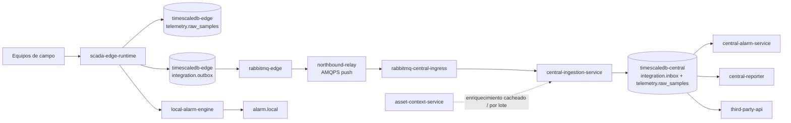

# Outcome del refinamiento — cliente-renovables/scada-general · 2026-05-26-arquitectura-concreta

Esto refina las secciones 3-6 de `2026-05-26-propuesta`, motivado por la necesidad de detallar servicios concretos, stack, flujos y comunicaciones edge↔central a nivel propuesta cliente.

Base heredada que este refinamiento no reabre: edge autónomo, TimescaleDB como opción preferente sujeta a validación operativa en edge, y RabbitMQ separado de la TSDB; aquí se concreta el shape de servicios, los cortes de responsabilidad y las interfaces [fuente: branches/cliente-renovables/problems/scada-general/council/2026-05-26-propuesta/outcome.md; fuente: branches/cliente-renovables/problems/scada-general/council/2026-05-26-arquitectura-concreta/follow_up.md; fuente: branches/cliente-renovables/problems/scada-general/council/2026-05-26-arquitectura-concreta/lead_notes.md].

## Catálogo de Servicios en Planta (Edge)

La síntesis converge en edge autónomo con bridge saliente fijo por AMQPS, outbox/inbox idempotente y distinción explícita entre deployables reales y capacidades internas. La única tensión relevante respecto al run padre es que `edge-reporter` pasa a servicio propio por directriz explícita del user, aunque el resto del edge debe seguir compacto [fuente: branches/cliente-renovables/problems/scada-general/council/2026-05-26-arquitectura-concreta/escalations/round_a.md; fuente: branches/cliente-renovables/problems/scada-general/council/2026-05-26-arquitectura-concreta/escalations/round_b.md; fuente: branches/cliente-renovables/problems/scada-general/council/2026-05-26-arquitectura-concreta/final_positions/expert_arquitecto-scada-distribuido.md; fuente: branches/cliente-renovables/problems/scada-general/council/2026-05-26-arquitectura-concreta/final_positions/expert_ingeniero-comunicaciones-industriales.md; fuente: branches/cliente-renovables/problems/scada-general/council/2026-05-26-arquitectura-concreta/final_positions/expert_ingeniero-datos-series-temporales.md; fuente: branches/cliente-renovables/problems/scada-general/council/2026-05-26-arquitectura-concreta/final_positions/expert_ingeniero-plataforma-cloud-native.md].

| Tipo | Servicio / contenedor | Responsabilidad | Tecnología principal | Dependencias |
|---|---|---|---|---|
| Deployable real | `scada-edge-runtime` | Concentrador OT único: adquisición multi-protocolo, normalización al canónico técnico, escritura local, evaluación de alarmas locales, publicación a outbox y drenaje norte | .NET LTS (`Worker Service` + `ASP.NET Core`) | `timescaledb-edge`, `rabbitmq-edge`, red OT local |
| Deployable real | `timescaledb-edge` | Historian local operativo; persiste muestras y estados; aloja también esquemas relacionales técnicos para `outbox`, trazabilidad y cursores locales | PostgreSQL + TimescaleDB | Volumen persistente local, `scada-edge-runtime`, `edge-reporter` |
| Deployable real | `rabbitmq-edge` | Buffer durable local de store-and-forward; mantiene backlog WAN y desacopla captura local de conectividad central; se mantiene austero, sin topología sofisticada como base de la propuesta | RabbitMQ + AMQP | Volumen persistente local, `scada-edge-runtime` |
| Deployable real | `edge-reporter` | Reporting local desde fase uno; genera extractos operativos y consumo local sin recargar el runtime de ingesta | ASP.NET Core + jobs .NET | `timescaledb-edge` |
| Capacidad interna de `scada-edge-runtime` | `field-driver-host` | Drivers y polling/suscripción hacia equipos de campo | OPC UA, Modbus TCP/RTU, MQTT, adaptador OPC DA si aplica | Equipos de campo |
| Capacidad interna de `scada-edge-runtime` | `technical-canonicalizer` | Construye el canónico técnico mínimo: `park_id`, `asset_id`, `signal_id`, `value`, `unit`, `source_timestamp`, `ingest_timestamp`, `quality_flag`, `schema_version` | .NET LTS | `field-driver-host` |
| Capacidad interna de `scada-edge-runtime` | `local-alarm-engine` | Evalúa alarmas locales y las publica como stream propio sin depender de central | .NET LTS | `timescaledb-edge` |
| Capacidad interna de `scada-edge-runtime` | `edge-outbox-writer` | Escribe muestra y evento pendiente en la misma transacción local para evitar dual-write implícito | .NET LTS + SQL/Npgsql | `timescaledb-edge` |
| Capacidad interna de `scada-edge-runtime` | `northbound-relay` | Consume de `rabbitmq-edge` y publica por `AMQPS` a central; es el bridge concreto fijado por este refinamiento | .NET LTS + cliente AMQP | `rabbitmq-edge`, `rabbitmq-central-ingress` |
| Capacidad interna de `scada-edge-runtime` | `config-cache` / `edge-ops-api` | Mantiene última configuración válida y expone health, backlog, estado de drivers y diagnóstico local; si central falla, edge sigue operando | ASP.NET Core | `control-plane-api` como fuente auxiliar |

Lectura de síntesis: en edge se nombran varias capacidades para hacer visible la arquitectura, pero solo cuatro son deployables reales. El debate fue unánime en rechazar microservicios finos adicionales en planta [fuente: branches/cliente-renovables/problems/scada-general/council/2026-05-26-arquitectura-concreta/critiques/expert_arquitecto-scada-distribuido.md; fuente: branches/cliente-renovables/problems/scada-general/council/2026-05-26-arquitectura-concreta/critiques/expert_ingeniero-plataforma-cloud-native.md].

## Catálogo de Servicios en Central

La convergencia en central es modular, pero con hot path corto: broker de ingreso, ingesta idempotente, historian corporativo y servicios de consumo desacoplados. `asset-context-service` queda independiente desde fase uno por respuesta explícita del user; en cambio, `iec61850` se mantiene como adaptación posterior y no como deployable obligatorio de esta propuesta [fuente: branches/cliente-renovables/problems/scada-general/council/2026-05-26-arquitectura-concreta/escalations/round_a.md; fuente: branches/cliente-renovables/problems/scada-general/council/2026-05-26-propuesta/outcome.md; fuente: branches/cliente-renovables/problems/scada-general/council/2026-05-26-arquitectura-concreta/final_positions/expert_ingeniero-plataforma-cloud-native.md; fuente: branches/cliente-renovables/problems/scada-general/council/2026-05-26-arquitectura-concreta/final_positions/expert_ingeniero-comunicaciones-industriales.md].

| Tipo | Servicio / contenedor | Responsabilidad | Tecnología principal | Dependencias |
|---|---|---|---|---|
| Deployable real | `rabbitmq-central-ingress` | Punto de entrada de telemetría, estados y alarmas locales desde todos los parques | RabbitMQ + AMQP sobre AMQPS | VPN/WAN saliente desde edge, `central-ingestion-service` |
| Deployable real | `central-ingestion-service` | Consume streams, aplica inbox idempotente, deduplica, marca `late data` y persiste en central; hace `ack` solo tras persistencia correcta | .NET LTS `Worker Service` | `rabbitmq-central-ingress`, `timescaledb-central` |
| Deployable real | `timescaledb-central` | Historian corporativo único para todos los parques; separa series temporales y trazabilidad técnica en esquemas distintos de la misma base | PostgreSQL + TimescaleDB | Storage persistente, `central-ingestion-service`, servicios consumidores |
| Deployable real | `asset-context-service` | Catálogo técnico/corporativo independiente de activos, señales, unidades y mapeos; aporta semántica extendida sin entrar en el hot path por muestra | ASP.NET Core + base relacional | `timescaledb-central` como fuente temporal de referencia, servicios de consumo |
| Deployable real | `central-alarm-service` | Consolida alarmado agregado en central a partir de muestras, estados y stream de alarmas locales recibido | .NET LTS `Worker Service` | `timescaledb-central`, `asset-context-service` |
| Deployable real | `central-reporter` | Reporting interno y externo desde central | ASP.NET Core + jobs .NET | `timescaledb-central`, `asset-context-service` |
| Deployable real | `third-party-api` | Exposición REST a terceros y frontends propios; consume datos ya consolidados, no ingiere desde planta | ASP.NET Core Web API | `timescaledb-central`, `asset-context-service` |
| Deployable real | `control-plane-api` | Configuración, manifiestos y directivas operativas descargadas por pull desde edge; no es prerrequisito para la operación básica del parque | ASP.NET Core Web API | `asset-context-service` |
| Capacidad interna de consumo | `telemetry-query-api` | Superficies de lectura `latest`, `raw-range` y `aggregated-range`; algunos expertos la separan, pero este refinamiento no la fija como contenedor obligatorio distinto de `third-party-api` / `central-reporter` | ASP.NET Core + SQL/Npgsql | `timescaledb-central`, `asset-context-service` |

Lectura de síntesis: el desacuerdo menor del panel no está en qué piezas existen, sino en cuántas conviene desplegar separadas desde el primer momento. La síntesis fija como obligatorios solo los cortes que cambian la propuesta cliente y deja `telemetry-query-api` como capacidad de consumo, no como contenedor adicional impuesto [fuente: branches/cliente-renovables/problems/scada-general/council/2026-05-26-arquitectura-concreta/critiques/expert_arquitecto-scada-distribuido.md; fuente: branches/cliente-renovables/problems/scada-general/council/2026-05-26-arquitectura-concreta/critiques/expert_ingeniero-plataforma-cloud-native.md].

## Flujo de Datos End-to-End

El flujo consolidado es el siguiente. Un equipo de campo entrega una muestra o estado a `scada-edge-runtime` por el adaptador OT correspondiente. `technical-canonicalizer` la transforma al envelope técnico mínimo y fija la clave única de muestra como `park_id + asset_id + signal_id + source_timestamp`, criterio confirmado por el user y reutilizado para deduplicación central [fuente: branches/cliente-renovables/problems/scada-general/council/2026-05-26-arquitectura-concreta/escalations/round_b.md; fuente: branches/cliente-renovables/problems/scada-general/council/2026-05-26-arquitectura-concreta/lead_notes.md].

En la misma transacción local, `edge-outbox-writer` persiste: (a) la muestra o estado en el esquema temporal de `timescaledb-edge`; y (b) el registro pendiente en el esquema relacional de integración. Un dispatcher publica ese outbox en `rabbitmq-edge`. Si la WAN cae, el parque sigue capturando, historizando, alarmando y reportando localmente; lo único que se difiere es la subida a central [fuente: branches/cliente-renovables/problems/scada-general/problem.md; fuente: branches/cliente-renovables/problems/scada-general/council/2026-05-26-arquitectura-concreta/final_positions/expert_ingeniero-datos-series-temporales.md; fuente: branches/cliente-renovables/problems/scada-general/council/2026-05-26-arquitectura-concreta/final_positions/expert_ingeniero-comunicaciones-industriales.md].

`northbound-relay` drena `rabbitmq-edge` y publica por `AMQPS` a `rabbitmq-central-ingress`. `central-ingestion-service` consume, registra inbox idempotente, hace `UPSERT`/inserción idempotente en `timescaledb-central`, marca `late data` cuando el dato llega con retraso operativo y solo entonces confirma el mensaje. Muestras, estados y alarmas locales viajan como streams lógicos separados sobre el mismo backbone. La prioridad fina de lectura del histórico central sigue abierta y no se fuerza en este refinamiento [fuente: branches/cliente-renovables/problems/scada-general/council/2026-05-26-arquitectura-concreta/escalations/round_b.md; fuente: branches/cliente-renovables/problems/scada-general/council/2026-05-26-arquitectura-concreta/lead_notes.md].

Lectura de síntesis: el patrón outbox/inbox es obligatorio y explícito; el replay no sale de consultas a la TSDB sino del buffer de integración y del broker local. Ese fue uno de los puntos más repetidos por los expertos de datos, comunicaciones y plataforma [fuente: branches/cliente-renovables/problems/scada-general/council/2026-05-26-arquitectura-concreta/critiques/expert_ingeniero-datos-series-temporales.md; fuente: branches/cliente-renovables/problems/scada-general/council/2026-05-26-arquitectura-concreta/critiques/expert_ingeniero-comunicaciones-industriales.md; fuente: branches/cliente-renovables/problems/scada-general/council/2026-05-26-arquitectura-concreta/critiques/expert_ingeniero-plataforma-cloud-native.md].

## Comunicación Edge ↔ Central

La topología lógica recomendada es estrella: cada parque empuja a central y no se propone tráfico parque↔parque. El plano de datos se resuelve con `rabbitmq-edge` + `northbound-relay` → `rabbitmq-central-ingress` por `AMQPS` con mTLS sobre la VPN existente; el plano de control se resuelve por `HTTPS REST` en modo pull contra `control-plane-api`. El edge debe seguir operando aunque `control-plane-api` no responda [fuente: branches/cliente-renovables/problems/scada-general/problem.md; fuente: branches/cliente-renovables/problems/scada-general/council/2026-05-26-arquitectura-concreta/final_positions/expert_ingeniero-comunicaciones-industriales.md; fuente: branches/cliente-renovables/problems/scada-general/council/2026-05-26-arquitectura-concreta/final_positions/expert_ingeniero-plataforma-cloud-native.md; fuente: branches/cliente-renovables/problems/scada-general/council/2026-05-26-arquitectura-concreta/lead_notes.md].

Patrones fijados por el refinamiento:
- `push` saliente iniciado desde planta;
- `store-and-forward` con backlog en `rabbitmq-edge` + outbox relacional;
- `outbox/inbox idempotente` extremo a extremo;
- `ack` en central solo tras persistencia correcta;
- RabbitMQ en edge mínimo austero, sin asumir `Shovel` o federación sofisticada como base;
- REST reservado a operación, configuración y consumo, no a backbone de telemetría [fuente: branches/cliente-renovables/problems/scada-general/council/2026-05-26-arquitectura-concreta/escalations/round_b.md; fuente: branches/cliente-renovables/problems/scada-general/council/2026-05-26-arquitectura-concreta/final_positions/expert_arquitecto-scada-distribuido.md].

Endpoints lógicos de propuesta:
- `amqps://rabbitmq-central-ingress/telemetry.sample` — stream de muestras;
- `amqps://rabbitmq-central-ingress/telemetry.state` — stream de estados;
- `amqps://rabbitmq-central-ingress/alarm.local` — stream de alarmas locales;
- `https://control-plane/api/edge/config` — configuración técnica descargada por edge;
- `https://control-plane/api/edge/releases` — manifiestos y compatibilidad de despliegue;
- `https://control-plane/api/edge/directives` — directivas operativas no críticas [fuente: branches/cliente-renovables/problems/scada-general/council/2026-05-26-arquitectura-concreta/proposals/expert_ingeniero-plataforma-cloud-native.md; fuente: branches/cliente-renovables/problems/scada-general/council/2026-05-26-arquitectura-concreta/final_positions/expert_ingeniero-comunicaciones-industriales.md].

Matriz mínima de compatibilidad edge↔central:

| Estado de contrato | Compatibilidad esperada | Regla operativa |
|---|---|---|
| Mismo envelope en edge y central | Compatibilidad total | Flujo normal |
| Edge con cambio menor backward compatible | Aceptable si central tolera campos opcionales nuevos | Desplegar central antes que edge |
| Edge con cambio mayor breaking | No aceptable sobre central anterior | Mantener captura local y backlog hasta alinear versiones |
| Central actualizado con parser backward compatible | Aceptable con edge en versión anterior inmediata | Regla preferida de rollout |

La matriz no fija versionado de producto detallado; fija una disciplina: central primero, edge después, y nunca a costa de perder captura local [fuente: branches/cliente-renovables/problems/scada-general/council/2026-05-26-arquitectura-concreta/escalations/round_b.md; fuente: branches/cliente-renovables/problems/scada-general/council/2026-05-26-arquitectura-concreta/final_positions/expert_ingeniero-plataforma-cloud-native.md; fuente: branches/cliente-renovables/problems/scada-general/council/2026-05-26-arquitectura-concreta/final_positions/expert_ingeniero-datos-series-temporales.md].

## Stack Tecnológico Completo

La propuesta tecnológica consolidada evita categorías genéricas y fija tecnologías concretas sin bajar aún a sizing o tuning físico, que sigue pendiente de validación por volumetría real [fuente: branches/cliente-renovables/problems/scada-general/problem.md; fuente: branches/cliente-renovables/problems/scada-general/council/2026-05-26-arquitectura-concreta/final_positions/expert_ingeniero-plataforma-cloud-native.md; fuente: branches/cliente-renovables/problems/scada-general/council/2026-05-26-arquitectura-concreta/final_positions/expert_ingeniero-datos-series-temporales.md].

| Capa / función | Tecnología concreta |
|---|---|
| Runtime de servicios | .NET LTS |
| APIs HTTP | ASP.NET Core |
| Procesos de fondo | .NET `Worker Service` |
| Adquisición OPC UA | OPC UA .NET Standard |
| Adquisición MQTT | MQTTnet |
| Adquisición Modbus | Librería Modbus para .NET |
| Cobertura legacy OPC DA | Adaptador encapsulado específico cuando aplique |
| Historian edge y central | PostgreSQL + TimescaleDB |
| Persistencia técnica relacional (`outbox`, `inbox`, `protocol_trace`, `delivery_attempts`) | Esquemas relacionales en la misma instancia PostgreSQL/TimescaleDB |
| Mensajería edge↔central | RabbitMQ + AMQP |
| Transporte seguro edge→central | AMQPS + mTLS |
| Acceso .NET a PostgreSQL/TimescaleDB | Npgsql |
| Envelope de eventos norte | JSON canónico con `schema_version` |
| Observabilidad | OpenTelemetry + métricas compatibles con Prometheus + logging estructurado |
| Empaquetado | Imágenes OCI |
| Orquestación en planta | Kubernetes pequeño por parque |
| Orquestación en central | OpenShift |
| Plantillas de despliegue | Helm |
| CI/CD | Azure DevOps Pipelines |

Dos decisiones de modelado quedan explícitas porque cambiaron la calidad de la propuesta durante el refinamiento: la trazabilidad técnica (`protocol`, `source_endpoint`, rechazo, duplicados, backlog, cursores de replay) va en esquema relacional de la misma base, no en la hypertable temporal; y el catálogo de contexto vive fuera del raw temporal para no inflar cardinalidad [fuente: branches/cliente-renovables/problems/scada-general/council/2026-05-26-arquitectura-concreta/escalations/round_b.md; fuente: branches/cliente-renovables/problems/scada-general/council/2026-05-26-arquitectura-concreta/final_positions/expert_ingeniero-datos-series-temporales.md].

## Interfaces entre Servicios

Las interfaces de propuesta quedan así, a nivel de comité técnico y sin bajar a Swagger ni contratos formales. La regla transversal es: aceptar primero el dato técnico, enriquecer después; por eso `asset-context-service` no debe bloquear la aceptación inicial por muestra [fuente: branches/cliente-renovables/problems/scada-general/council/2026-05-26-arquitectura-concreta/critiques/expert_arquitecto-scada-distribuido.md; fuente: branches/cliente-renovables/problems/scada-general/council/2026-05-26-arquitectura-concreta/critiques/expert_ingeniero-datos-series-temporales.md].

| Origen | Destino | Qué expone | Cómo lo consume el otro | Protocolo |
|---|---|---|---|---|
| Equipos de campo | `scada-edge-runtime` | Muestras, estados y eventos de dispositivo | Adaptadores industriales dentro del concentrador OT | OPC UA / Modbus / MQTT / OPC DA |
| `scada-edge-runtime` | `timescaledb-edge` | `raw_samples`, estados y registro técnico local | Escritura transaccional e idempotente por SQL | PostgreSQL / Npgsql |
| `edge-outbox-writer` | `timescaledb-edge` | Eventos pendientes de subida y trazabilidad local | Inserción en esquema relacional en la misma transacción que la muestra | PostgreSQL / Npgsql |
| `scada-edge-runtime` | `rabbitmq-edge` | Publicación durable de `telemetry.sample`, `telemetry.state` y `alarm.local` | Dispatcher / relay consume el outbox y publica | AMQP |
| `northbound-relay` | `rabbitmq-central-ingress` | Replay + near-real-time desde cada parque | Push saliente con reintento y confirmación | AMQPS |
| `rabbitmq-central-ingress` | `central-ingestion-service` | Entrega desacoplada por stream y parque | Consumo con `ack` tras persistencia correcta | AMQP |
| `central-ingestion-service` | `timescaledb-central` | Inbox idempotente, inserción temporal, `late data`, duplicados y journaling técnico | SQL por lote / `UPSERT` idempotente | PostgreSQL / Npgsql |
| `central-ingestion-service` | `asset-context-service` | Lookup de contexto y metadatos | Consulta cacheada o por lote; nunca per-muestra en hot path | REST interno |
| `timescaledb-central` | `central-alarm-service` | Muestras, estados y stream de alarmas locales recibido | Lectura técnica + correlación agregada | PostgreSQL / Npgsql |
| `timescaledb-central` + `asset-context-service` | `central-reporter` | Histórico, latest y contexto para reporting | Consultas de lectura y generación batch | PostgreSQL / REST interno |
| `timescaledb-central` + `asset-context-service` | `third-party-api` | Series, estados, alarmas y vistas de consumo | API desacoplada del plano de ingestión | HTTPS REST |
| `scada-edge-runtime` / `edge-reporter` | `control-plane-api` | Pull de configuración, manifiestos y directivas | Descarga periódica; si falla, edge sigue con última configuración válida | HTTPS REST |

## Veredicto sobre la inclinación del user

La inclinación del user queda ampliamente confirmada en cuatro puntos: el documento final debía nombrar servicios concretos; debía fijar un mecanismo edge→central no ambiguo; debía distinguir deployables reales de capacidades internas; y debía mostrar stack e interfaces a nivel propuesta cliente, no a nivel académico [fuente: branches/cliente-renovables/problems/scada-general/council/2026-05-26-arquitectura-concreta/follow_up.md; fuente: branches/cliente-renovables/problems/scada-general/council/2026-05-26-arquitectura-concreta/lead_notes.md].

También queda confirmada la directriz de que `edge-reporter` y `asset-context-service` existan desde fase uno, y de que a central suban no solo muestras, sino también estados y alarmas locales como stream propio [fuente: branches/cliente-renovables/problems/scada-general/council/2026-05-26-arquitectura-concreta/escalations/round_a.md; fuente: branches/cliente-renovables/problems/scada-general/council/2026-05-26-arquitectura-concreta/escalations/round_b.md].

La inclinación del user sí desafía parcialmente dos inercias del run padre y de algunas propuestas del panel. La primera: no todo lo que se nombra debe terminar como contenedor independiente; el edge sigue siendo compacto y el despiece fino se rechaza. La segunda: REST no puede interpretarse como backbone planta→central; el backbone queda fijado como AMQPS con store-and-forward e idempotencia explícita [fuente: branches/cliente-renovables/problems/scada-general/council/2026-05-26-propuesta/outcome.md; fuente: branches/cliente-renovables/problems/scada-general/council/2026-05-26-arquitectura-concreta/critiques/expert_ingeniero-comunicaciones-industriales.md; fuente: branches/cliente-renovables/problems/scada-general/council/2026-05-26-arquitectura-concreta/critiques/expert_ingeniero-plataforma-cloud-native.md].

El debate deja solo dos aperturas legítimas, y conviene no maquillarlas como cerradas: la prioridad de consulta del histórico central sigue abierta; y la exposición REST a terceros podría evolucionar hacia suscripciones o event push, pero no se fija todavía en este refinamiento [fuente: branches/cliente-renovables/problems/scada-general/council/2026-05-26-arquitectura-concreta/escalations/round_a.md; fuente: branches/cliente-renovables/problems/scada-general/council/2026-05-26-arquitectura-concreta/escalations/round_b.md; fuente: branches/cliente-renovables/problems/scada-general/council/2026-05-26-arquitectura-concreta/lead_notes.md].