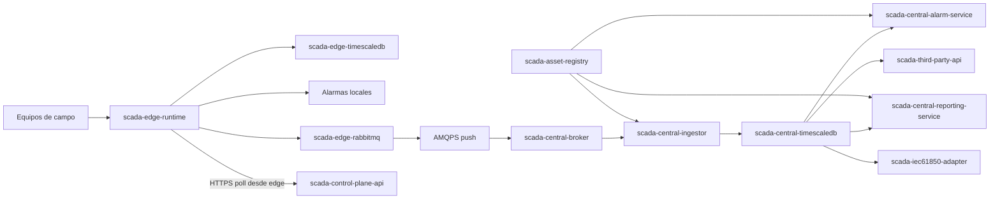

## Posición

Propongo aterrizar el outcome padre como una arquitectura **cloud-native híbrida**: **planta compacta** con **máximo 3 unidades desplegables** y **central descompuesta por bounded contexts** sobre OpenShift [fuente: branches/cliente-renovables/problems/scada-general/council/2026-05-26-propuesta/outcome.md; fuente: branches/cliente-renovables/problems/scada-general/council/2026-05-26-propuesta/final_positions/expert_ingeniero-plataforma-cloud-native.md].

### Catálogo de Servicios en Planta (Edge)

| Servicio / contenedor | Responsabilidad | Tecnología principal | Dependencias |
|---|---|---|---|
| `scada-edge-runtime` | Única aplicación de dominio en planta: adquisición multi-protocolo, normalización al canónico técnico, procesado, evaluación de alarmas locales, publicación hacia la cola local, API de health/configuración local. | .NET LTS con `Worker Service` + `ASP.NET Core Web API`; drivers/proveedores industriales según equipo (OPC UA, Modbus, MQTT, OPC DA) [fuente: branches/cliente-renovables/problems/scada-general/problem.md] | `scada-edge-timescaledb`, `scada-edge-rabbitmq` |
| `scada-edge-timescaledb` | Historización local operativa, consulta local y base para replay/reconciliación cuando haya caída WAN de días [fuente: branches/cliente-renovables/problems/scada-general/council/2026-05-26-propuesta/escalations/round_a.md; fuente: branches/cliente-renovables/problems/scada-general/council/2026-05-26-propuesta/outcome.md] | TimescaleDB sobre PostgreSQL [fuente: branches/cliente-renovables/problems/scada-general/problem.md; fuente: branches/cliente-renovables/problems/scada-general/council/2026-05-26-propuesta/outcome.md] | Volumen persistente local |
| `scada-edge-rabbitmq` | Cola persistente de store-and-forward separada de la TSDB para sincronización norte, desacoplando adquisición local de conectividad WAN [fuente: branches/cliente-renovables/problems/scada-general/council/2026-05-26-propuesta/escalations/round_b.md; fuente: branches/cliente-renovables/problems/scada-general/council/2026-05-26-propuesta/user_directives.md] | RabbitMQ + AMQP | Volumen persistente local |

**Descomposición interna recomendada de `scada-edge-runtime`**: `protocol-adapter-host`, `telemetry-normalizer`, `local-alarm-engine`, `sync-publisher`, `edge-config-api`. Mantengo estas piezas **dentro del mismo deployable** para no romper la austeridad operacional exigida por un Kubernetes pequeño sobre **3 máquinas por parque** [fuente: branches/cliente-renovables/problems/scada-general/problem.md; fuente: branches/cliente-renovables/problems/scada-general/council/2026-05-26-propuesta/outcome.md].

### Catálogo de Servicios en Central

| Servicio / contenedor | Responsabilidad | Tecnología principal | Dependencias |
|---|---|---|---|
| `scada-central-broker` | Punto de entrada de telemetría desde todos los parques; desacopla recepción, replay y consumo interno. | RabbitMQ + AMQP sobre TLS [fuente: branches/cliente-renovables/problems/scada-general/council/2026-05-26-propuesta/outcome.md] | Persistencia de broker |
| `scada-central-ingestor` | Consume telemetría canónica, valida envelope, deduplica, marca dato tardío y persiste en central. | .NET LTS `Worker Service` + cliente RabbitMQ | `scada-central-broker`, `scada-central-timescaledb`, `scada-asset-registry` |
| `scada-central-timescaledb` | Historización central de toda la telemetría y base para dashboards, reporting y analítica futura. | TimescaleDB sobre PostgreSQL [fuente: branches/cliente-renovables/problems/scada-general/council/2026-05-26-propuesta/outcome.md] | Almacenamiento persistente |
| `scada-asset-registry` | Catálogo técnico de activos, señales, unidades, namespaces y mapeos parque→modelo corporativo. | .NET LTS `ASP.NET Core Web API` + gRPC interno | Base relacional/configuración |
| `scada-central-alarm-service` | Recalcula/deriva alarmas agregadas en central a partir del dato recibido y del catálogo técnico corporativo. | .NET LTS `Worker Service` | `scada-central-broker`, `scada-central-timescaledb`, `scada-asset-registry` |
| `scada-central-reporting-service` | Genera reportes internos/externos a partir de datos historizados y reglas de presentación. | .NET LTS `ASP.NET Core Web API` + jobs batch | `scada-central-timescaledb`, `scada-asset-registry` |
| `scada-third-party-api` | Expone consumo REST a terceros y a frontends propios sin acoplarlos al plano de ingestión. | .NET LTS `ASP.NET Core Web API` + OpenAPI | `scada-central-timescaledb`, `scada-asset-registry` |
| `scada-iec61850-adapter` | Adaptador de publicación IEC 61850 cuando esa integración entre en fase posterior. | Adaptador específico sobre .NET LTS [fuente: branches/cliente-renovables/problems/scada-general/problem.md; fuente: branches/cliente-renovables/problems/scada-general/council/2026-05-26-propuesta/escalations/round_a.md] | `scada-central-timescaledb`, `scada-asset-registry` |
| `scada-control-plane-api` | Endpoint central para que cada edge consulte configuración, manifiestos de release y directivas operativas mediante tráfico saliente desde planta. | .NET LTS `ASP.NET Core Web API` | `scada-asset-registry` |

### Flujo de Datos End-to-End

1. Un equipo de campo publica o expone datos por OPC UA, Modbus, MQTT, OPC DA u otro protocolo soportado por el concentrador único de planta [fuente: branches/cliente-renovables/problems/scada-general/problem.md].
2. `scada-edge-runtime` adquiere la señal, la normaliza al **canónico técnico** y preserva `source timestamp` y `quality flags` [fuente: branches/cliente-renovables/problems/scada-general/council/2026-05-26-propuesta/outcome.md; fuente: branches/cliente-renovables/problems/scada-general/council/2026-05-26-propuesta/escalations/round_a.md].
3. El dato se persiste en `scada-edge-timescaledb`; en paralelo se evalúan alarmas locales con el dato disponible en planta [fuente: branches/cliente-renovables/problems/scada-general/problem.md; fuente: branches/cliente-renovables/problems/scada-general/council/2026-05-26-propuesta/escalations/round_a.md].
4. `scada-edge-runtime` publica un `TelemetryEnvelope` duradero en `scada-edge-rabbitmq`, que actúa como buffer de sincronización separado de la TSDB [fuente: branches/cliente-renovables/problems/scada-general/council/2026-05-26-propuesta/escalations/round_b.md].
5. El módulo `sync-publisher` reenvía por `AMQPS` hacia `scada-central-broker` mediante conexión **push iniciada desde planta** [fuente: branches/cliente-renovables/problems/scada-general/council/2026-05-26-propuesta/escalations/round_a.md; fuente: branches/cliente-renovables/problems/scada-general/council/2026-05-26-propuesta/outcome.md].
6. `scada-central-ingestor` consume, deduplica, marca retraso cuando aplique y persiste toda la telemetría en `scada-central-timescaledb` [fuente: branches/cliente-renovables/problems/scada-general/council/2026-05-26-propuesta/outcome.md].
7. `scada-central-alarm-service`, `scada-central-reporting-service` y `scada-third-party-api` consumen el dato central ya historizado y enriquecido. IEC 61850 queda como adaptador posterior, no como backbone actual [fuente: branches/cliente-renovables/problems/scada-general/problem.md; fuente: branches/cliente-renovables/problems/scada-general/council/2026-05-26-propuesta/outcome.md].
8. Si la WAN cae durante días, la planta sigue capturando, historizando y alarmando localmente; al reconectar, el backlog se vacía sin ventana máxima impuesta y central procesa el histórico conforme llega, preservando orden por señal [fuente: branches/cliente-renovables/problems/scada-general/council/2026-05-26-propuesta/escalations/round_a.md; fuente: branches/cliente-renovables/problems/scada-general/council/2026-05-26-propuesta/escalations/round_b.md].

### Comunicación Edge ↔ Central

**Topología lógica propuesta**
- **No propongo tráfico parque ↔ parque**: todo intercambio inter-planta ocurre en central.
- **Plano de datos**: `scada-edge-runtime` / `scada-edge-rabbitmq` → `scada-central-broker` por `AMQPS` con conexión saliente iniciada desde planta [fuente: branches/cliente-renovables/problems/scada-general/council/2026-05-26-propuesta/escalations/round_a.md].
- **Plano de control**: `scada-edge-runtime` hace `poll` por `HTTPS REST` contra `scada-control-plane-api` para descargar configuración, manifiestos de release y parámetros; así se respeta la restricción de que central no entra activamente al parque [fuente: branches/cliente-renovables/problems/scada-general/problem.md; fuente: branches/cliente-renovables/problems/scada-general/council/2026-05-26-arquitectura-concreta/follow_up.md].
- **Patrón operativo**: `push + store-and-forward + replay ordenado`; REST queda fuera del backbone de telemetría [fuente: branches/cliente-renovables/problems/scada-general/council/2026-05-26-propuesta/outcome.md].

**Endpoints lógicos propuestos**
- `amqps://central-broker/telemetry/<planta-id>` → ingestión de `TelemetryEnvelope`.
- `amqps://central-broker/alarm-events/<planta-id>` → eventos de alarma derivados en planta si se decide publicarlos también como stream.
- `https://central-control/api/edge/v1/config/<planta-id>` → configuración técnica y catálogos.
- `https://central-control/api/edge/v1/releases/<planta-id>` → manifiesto de versión/Helm release.
- `https://central-control/api/edge/v1/acks` → acuses de configuración o estado de rollout.

### Stack Tecnológico Completo

| Capa / función | Tecnología propuesta |
|---|---|
| Runtime de servicios | .NET LTS [fuente: branches/cliente-renovables/problems/scada-general/problem.md] |
| Servicios batch / consumo continuo | `Worker Service` de .NET |
| APIs HTTP | `ASP.NET Core Web API` |
| Comunicación asíncrona | RabbitMQ + AMQP |
| Comunicación síncrona interna en central | gRPC para consultas técnicas tipadas a `scada-asset-registry` |
| Comunicación síncrona externa | HTTPS REST para terceros y control plane |
| TSDB edge y central | TimescaleDB preferente única, sujeta a PoC operativa en edge [fuente: branches/cliente-renovables/problems/scada-general/council/2026-05-26-propuesta/outcome.md] |
| Empaquetado | Imágenes OCI |
| Orquestación edge | Kubernetes pequeño en parque [fuente: branches/cliente-renovables/problems/scada-general/problem.md] |
| Orquestación central | OpenShift [fuente: branches/cliente-renovables/problems/scada-general/problem.md] |
| Despliegue | Azure DevOps Pipelines + Helm charts [fuente: branches/cliente-renovables/problems/scada-general/problem.md] |
| Configuración | ConfigMaps/Secrets de Kubernetes/OpenShift |
| Observabilidad | OpenTelemetry + métricas Prometheus-compatible + logging estructurado |
| Acceso a PostgreSQL/TimescaleDB desde .NET | `Npgsql`; usar ORM solo donde aporte, no en ingestión masiva |
| Contratos de eventos | `JSON` canónico para telemetría norte; `Protobuf` en gRPC interno |

**Helm/manifiestos recomendados**
- `charts/scada-edge`: despliega `scada-edge-runtime`, `scada-edge-timescaledb`, `scada-edge-rabbitmq` y su configuración por parque.
- `charts/scada-central-platform`: despliega `scada-central-broker`, `scada-central-timescaledb` y recursos compartidos.
- `charts/scada-central-services`: despliega `scada-central-ingestor`, `scada-asset-registry`, `scada-central-alarm-service`, `scada-central-reporting-service`, `scada-third-party-api`, `scada-control-plane-api` y, cuando aplique, `scada-iec61850-adapter`.

**Pipeline Azure DevOps propuesto**
1. `build-test`: restaurar, compilar y probar proyectos .NET.
2. `package`: construir imágenes OCI y versionar charts Helm.
3. `deploy-central`: promover a OpenShift.
4. `deploy-edge`: publicar el bundle Helm versionado para despliegue sincronizado en parques con rollback por chart/tag, coherente con la directriz de rollback del user [fuente: branches/cliente-renovables/problems/scada-general/council/2026-05-26-propuesta/escalations/round_a.md; fuente: branches/cliente-renovables/problems/scada-general/council/2026-05-26-propuesta/escalations/round_b.md].

### Interfaces entre Servicios

| Origen | Destino | Qué expone / transmite | Cómo lo consume el siguiente | Protocolo |
|---|---|---|---|---|
| Equipos de campo | `scada-edge-runtime` | Telemetría bruta y estado de dispositivo | Adaptadores industriales específicos dentro del concentrador único | OPC UA / Modbus / MQTT / OPC DA [fuente: branches/cliente-renovables/problems/scada-general/problem.md] |
| `scada-edge-runtime` | `scada-edge-timescaledb` | Series temporales normalizadas + `source timestamp` + `quality flags` | Escritura transaccional/batch | SQL sobre PostgreSQL |
| `scada-edge-runtime` | `scada-edge-rabbitmq` | `TelemetryEnvelope` canónico para sincronización | Publicación durable por cola | AMQP |
| `scada-edge-runtime` | `scada-central-broker` | Replay de telemetría y eventos norte | `sync-publisher` confirma entrega y reintenta si WAN cae | AMQPS |
| `scada-central-broker` | `scada-central-ingestor` | Stream de telemetría por planta | Consumidor idempotente con deduplicación | AMQP |
| `scada-central-ingestor` | `scada-asset-registry` | Resolución de metadatos técnicos y mapeos corporativos | Consulta síncrona tipada | gRPC |
| `scada-central-ingestor` | `scada-central-timescaledb` | Persistencia de telemetría corporativa | Escritura batch / upsert idempotente | SQL sobre PostgreSQL |
| `scada-central-timescaledb` | `scada-central-alarm-service` | Lectura de series + contexto técnico | Jobs/consumidores que recalculan alarmas agregadas | SQL + eventos AMQP opcionales |
| `scada-central-reporting-service` | `scada-central-timescaledb` y `scada-asset-registry` | Consultas para reportes internos/externos | API y jobs batch | SQL + gRPC |
| `scada-third-party-api` | Consumidores externos | Datos agregados, alarmas, series expuestas | API autenticada desacoplada del plano de ingestión | HTTPS REST |
| `scada-iec61850-adapter` | Terceros industriales | Publicación IEC 61850 cuando aplique | Adaptador separado de la ingesta core | IEC 61850 |
| `scada-edge-runtime` | `scada-control-plane-api` | Solicitud de configuración, manifiestos y directivas | Poll saliente desde edge | HTTPS REST |

## Razones

- La planta debe seguir operando sin WAN durante **días** y con almacenamiento/cola local separados; por eso propongo un edge compacto con TSDB + broker + runtime consolidado, no microservicios finos [fuente: branches/cliente-renovables/problems/scada-general/council/2026-05-26-propuesta/escalations/round_a.md; fuente: branches/cliente-renovables/problems/scada-general/council/2026-05-26-propuesta/escalations/round_b.md].
- El user confirmó que la transmisión de datos es **desde el parque hacia la central**; por tanto, el patrón correcto es `push` saliente desde edge, y cualquier control/configuración debe resolverse también con tráfico iniciado desde planta [fuente: branches/cliente-renovables/problems/scada-general/council/2026-05-26-propuesta/escalations/round_a.md].
- REST no debe ser el backbone de telemetría; AMQP sí encaja con desconexiones, replay y desacoplamiento temporal ya verificados por el run padre [fuente: branches/cliente-renovables/problems/scada-general/council/2026-05-26-propuesta/outcome.md].
- La central sí justifica bounded contexts separados porque actúa como plano de consumo agregado, reporting, APIs y futuras capacidades analíticas, no como simple mirror de planta [fuente: branches/cliente-renovables/problems/scada-general/problem.md; fuente: branches/cliente-renovables/problems/scada-general/council/2026-05-26-propuesta/escalations/round_a.md].
- Mantengo TimescaleDB como opción preferente única porque es la convergencia del council, pero no elimino la condición de PoC operativa en edge antes de cerrarla como decisión final [fuente: branches/cliente-renovables/problems/scada-general/council/2026-05-26-propuesta/outcome.md].
- Azure DevOps + Helm es la combinación más coherente con el contexto dado para despliegue sincronizado y rollback explícito, sin introducir dependencia adicional de una plataforma GitOps no pedida por el user [fuente: branches/cliente-renovables/problems/scada-general/problem.md; fuente: branches/cliente-renovables/problems/scada-general/council/2026-05-26-propuesta/escalations/round_b.md].

## Supuestos

- El equipo de infraestructura expondrá en central endpoints alcanzables desde la VPN para `AMQPS` y `HTTPS`, aunque la central no pueda iniciar conexiones hacia planta [fuente: branches/cliente-renovables/problems/scada-general/problem.md].
- OpenShift, Kubernetes de parque, volúmenes persistentes, certificados y red base siguen fuera de alcance del equipo de desarrollo, tal como indicó el problema [fuente: branches/cliente-renovables/problems/scada-general/problem.md].
- IEC 61850 queda fuera del backbone inicial y puede entrar como adaptador posterior sin rediseñar la plataforma core [fuente: branches/cliente-renovables/problems/scada-general/problem.md; fuente: branches/cliente-renovables/problems/scada-general/council/2026-05-26-propuesta/escalations/round_a.md].
- No fijo réplicas, CPU/memoria ni sizing de discos porque el volumen real de señales sigue siendo una caja negra; cualquier cifra aquí sería `est.` y debe verificarse antes de decidir [fuente: branches/cliente-renovables/problems/scada-general/council/2026-05-26-propuesta/escalations/round_b.md].